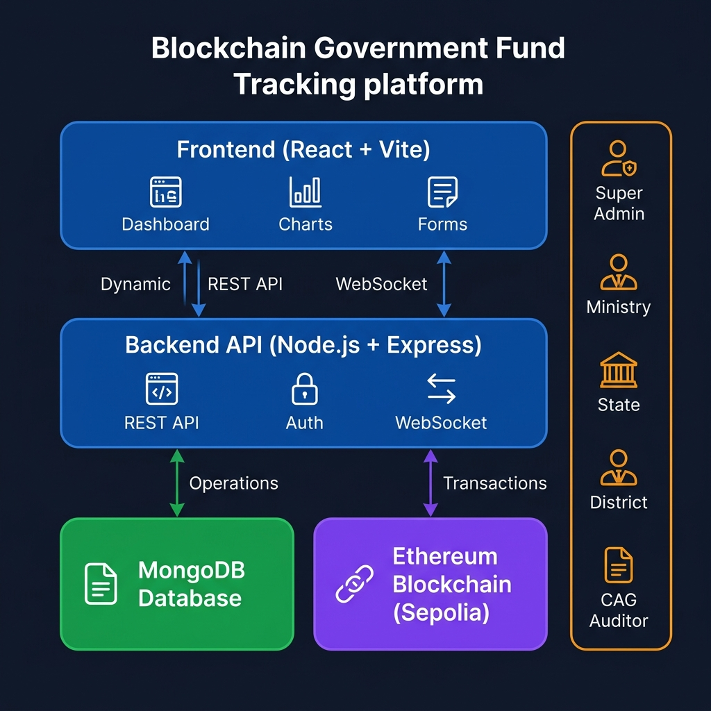
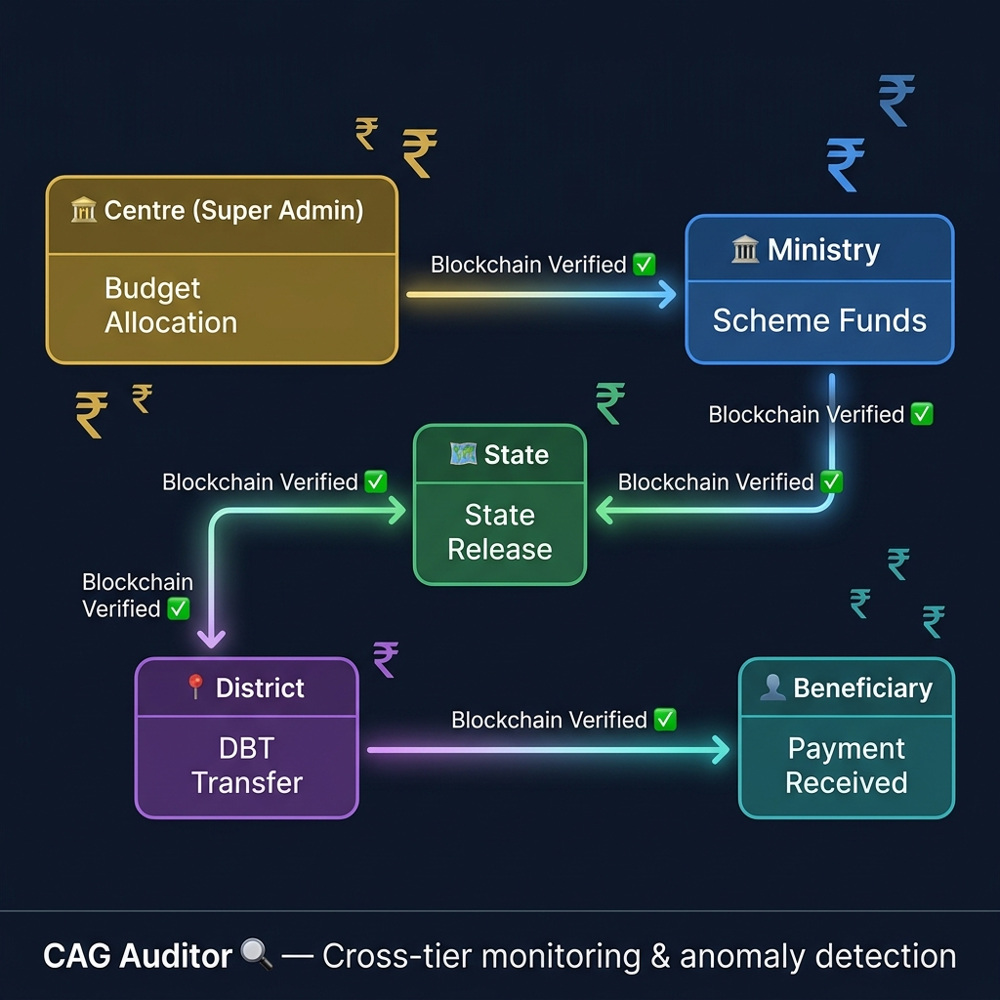

<p align="center">
  
</p>

<p align="center">
  <strong>🔗 Blockchain-Powered Public Fund Transparency Platform</strong>
</p>

<p align="center">
  
  
  
  
  
  
</p>

<p align="center">
  <a href="#-features">Features</a> •
  <a href="#-architecture">Architecture</a> •
  <a href="#-fund-flow">Fund Flow</a> •
  <a href="#-tech-stack">Tech Stack</a> •
  <a href="#-getting-started">Getting Started</a> •
  <a href="#-smart-contracts">Smart Contracts</a> •
  <a href="#-role-based-access">Roles</a>
</p>

---

## 📋 About

**JanNidhi Tracker** is an end-to-end, blockchain-first platform for tracking government welfare fund disbursements across India's administrative hierarchy. Every rupee allocated from the Centre to beneficiaries is immutably recorded on the Ethereum blockchain, ensuring **zero data tampering**, **full auditability**, and **real-time transparency**.

The platform enforces an **atomic persistence pattern**: financial data is written to the blockchain first — if the on-chain transaction fails, **nothing is saved to the database**. This guarantees that the database is always a faithful mirror of the blockchain ledger.

---

## ✨ Features

### 🏦 Multi-Tier Fund Management
- **Super Admin** — Budget allocation to ministries with on-chain registration
- **Ministry Admin** — Scheme creation and fund release to states via MetaMask
- **State Admin** — State-level fund distribution to districts
- **District Admin** — Beneficiary enrollment and Direct Benefit Transfer (DBT)
- **CAG Auditor** — Cross-tier verification, anomaly detection, and flag management

### 🔗 Blockchain Integrity
- All financial transactions recorded on **Ethereum Sepolia Testnet**
- Smart contracts for fund management, scheme registry, and audit logging
- **Etherscan-verified** transaction hashes and block numbers
- Wallet balance verification before every release

### 🛡️ Audit & Compliance
- Real-time **leakage detection** (unaccounted funds analysis)
- Multi-severity flag system (Critical → Info)
- Fund trail timeline from Centre to Beneficiary
- Cross-verification: MongoDB vs Blockchain data integrity checks

### 👤 Citizen Access
- Aadhaar-based beneficiary verification
- Payment status tracking
- OTP-based secure login
- Public scheme information portal

---

## 🏗️ Architecture

<p align="center">
  
</p>

```
┌─────────────────────────────────────────────────────────────┐
│                    FRONTEND (React + Vite)                   │
│  Landing Page │ Role Dashboards │ MetaMask Integration       │
└──────────────────────┬──────────────────────────────────────┘
                       │ REST API + WebSocket
┌──────────────────────▼──────────────────────────────────────┐
│                  BACKEND (Node.js + Express)                 │
│  Auth │ Controllers │ Blockchain Service │ Socket.IO         │
└────────┬─────────────────────────────────┬──────────────────┘
         │                                 │
┌────────▼────────┐              ┌─────────▼─────────┐
│    MongoDB       │              │  Ethereum Sepolia  │
│  (Metadata +     │              │  (Immutable Ledger)│
│   Transactions)  │              │  Smart Contracts   │
└─────────────────┘              └────────────────────┘
```

### Data Persistence Rules

| Data Type | Storage | Rationale |
|---|---|---|
| Ministry/State/District Creation | MongoDB only | Administrative metadata |
| Beneficiary Enrollment | MongoDB only | Personal data — no PII on-chain |
| Scheme Creation | MongoDB + Blockchain | Audit trail for scheme lifecycle |
| Budget Allocation (SA → Ministry) | Blockchain first → MongoDB | Financial — immutable |
| Fund Release (Ministry → State) | Blockchain first → MongoDB | Financial — immutable |
| Fund Release (State → District) | Blockchain first → MongoDB | Financial — immutable |
| Beneficiary Payment (DBT) | Blockchain first → MongoDB | Financial — immutable |
| Audit Flags | MongoDB + Blockchain | Tamper-proof flag records |

---

## 💰 Fund Flow

<p align="center">
  
</p>

```
🏦 Centre (Super Admin)
   │
   │ allocateBudget() ← Server-side (deployer key)
   ▼
🏛️ Ministry Admin
   │
   │ releaseFunds() ← MetaMask signed
   ▼
🗺️ State Admin
   │
   │ releaseFunds() ← MetaMask signed
   ▼
📍 District Admin
   │
   │ triggerPayment() ← Server wallet (batch DBT)
   ▼
👤 Beneficiary
   └── Receives ₹ via Direct Benefit Transfer

🔍 CAG Auditor — Monitors all tiers in real-time
```

### Wallet Strategy

| Role | Wallet Type | Signing Method |
|---|---|---|
| Super Admin | Backend deployer key | Server-side (auto) |
| Ministry Admin | Personal MetaMask | Browser popup |
| State Admin | Personal MetaMask | Browser popup |
| District Admin | Server wallet | Backend `.env` key |
| CAG Auditor | Read-only | No signing needed |

---

## 🛠️ Tech Stack

<p align="center">
  
</p>

### Frontend
| Technology | Purpose |
|---|---|
| **React 18** | Component-based UI |
| **Vite** | Lightning-fast HMR & builds |
| **React Router v6** | Role-based routing |
| **Ethers.js v6** | Blockchain interaction |
| **Lucide React** | Icon system |
| **Vanilla CSS** | Custom design system |

### Backend
| Technology | Purpose |
|---|---|
| **Node.js + Express** | REST API server |
| **MongoDB + Mongoose** | Document database |
| **JWT** | Authentication tokens |
| **bcryptjs** | Password hashing |
| **Socket.IO** | Real-time auditor notifications |
| **Ethers.js v6** | Server-side blockchain calls |

### Blockchain
| Technology | Purpose |
|---|---|
| **Solidity 0.8** | Smart contract language |
| **Hardhat** | Contract compilation & deployment |
| **Ethereum Sepolia** | Testnet for verification |
| **MetaMask** | Browser wallet integration |

---

## 📦 Smart Contracts

Deployed on **Sepolia Testnet**:

### 1. `FundManager.sol`
> Core contract managing the entire fund lifecycle

- `registerMinistry()` — Register ministry wallets on-chain
- `allocateBudget()` — Allocate budget from Centre to Ministry
- `releaseFunds()` — Transfer funds between tiers
- `walletBalance()` — Read on-chain balance for any wallet
- Balance tracking per wallet with overflow protection

### 2. `SchemeRegistry.sol`
> Scheme lifecycle management

- `createScheme()` — Register welfare schemes
- `isSchemeActive()` — Verify scheme status
- `getScheme()` — Read scheme details from chain

### 3. `AuditLogger.sol`
> Immutable audit trail

- `enrollBeneficiary()` — Record beneficiary enrollment
- `recordPayment()` — Log DBT payments
- `raiseFlag()` — Store audit flags on-chain

---

## 🚀 Getting Started

### Prerequisites

- **Node.js** v18+
- **MongoDB** running locally or Atlas URI
- **MetaMask** browser extension (for Ministry/State roles)
- **Git**

### 1. Clone the Repository

```bash
git clone https://github.com/your-username/JanNidhi-Tracker.git
cd JanNidhi-Tracker
```

### 2. Setup Backend

```bash
cd backend
npm install
```

Create `.env` file:

```env
PORT=5000
NODE_ENV=development
MONGO_URI=mongodb://localhost:27017/jannidhi
JWT_SECRET=your_secret_key
JWT_EXPIRES_IN=24h
CORS_ORIGIN=http://localhost:5173
BLOCKCHAIN_RPC_URL=https://ethereum-sepolia-rpc.publicnode.com
FUND_MANAGER_CONTRACT=0x4949d642e2609BCD59db1b15DBe1004D290Db2f0
SCHEME_REGISTRY_CONTRACT=0x111454C35deC4a67Fc103E2345E7904B9D9c3560
AUDIT_LOGGER_CONTRACT=0xDDe66445863a01eD8293639B61eD3e513E7e7b07
PRIVATE_KEY=your_deployer_private_key
```

### 3. Setup Frontend

```bash
cd frontend
npm install
```

### 4. Seed Demo Data (Optional)

```bash
cd backend
node seeds/seed-transactions.js
```

### 5. Run Development Servers

```bash
# Terminal 1 — Backend
cd backend
npm run dev

# Terminal 2 — Frontend
cd frontend
npm run dev
```

Open **http://localhost:5173** in your browser.

### 6. MetaMask Setup

1. Install MetaMask browser extension
2. Switch to **Sepolia Testnet**
3. Get test ETH from [Sepolia Faucet](https://sepoliafaucet.com/)
4. Connect wallet when prompted in Ministry/State dashboards

---

## 👥 Role-Based Access

### Default Test Accounts

| Role | Email | Password | Capabilities |
|---|---|---|---|
| Super Admin | `admin@jannidhi.gov.in` | `Admin@1234` | Create ministries, allocate budgets |
| Ministry Admin | Created by Super Admin | Auto-generated | Create schemes, release to states |
| State Admin | Created by Ministry | Auto-generated | Release funds to districts |
| District Admin | Created by State | Auto-generated | Enroll beneficiaries, trigger DBT |
| CAG Auditor | Created by Super Admin | Auto-generated | Monitor, flag, audit |

### Dashboard Features by Role

<details>
<summary><strong>🏦 Super Admin Dashboard</strong></summary>

- Create Ministry accounts
- Allocate budget (blockchain-verified)
- View budget history & transaction trail
- Create CAG auditor accounts
- System settings management
</details>

<details>
<summary><strong>🏛️ Ministry Dashboard</strong></summary>

- Create State admin accounts
- Create welfare schemes
- Release funds to states (MetaMask signed)
- View transaction history with Etherscan links
- Respond to CAG flags
</details>

<details>
<summary><strong>🗺️ State Dashboard</strong></summary>

- Create District admin accounts
- Release funds to districts (MetaMask signed)
- View received budgets
- Track disbursement status
</details>

<details>
<summary><strong>📍 District Dashboard</strong></summary>

- Add beneficiaries (Aadhaar-based)
- Trigger bulk DBT payments
- View payment status & blockchain confirmation
- Track scheme-wise beneficiary lists
</details>

<details>
<summary><strong>🔍 CAG Auditor Dashboard</strong></summary>

- Real-time transaction feed with blockchain verification
- Fund trail timeline (Centre → Beneficiary)
- Leakage analysis & detection
- Raise and manage audit flags
- Cross-verify MongoDB vs Blockchain data
</details>

---

## 📁 Project Structure

```
JanNidhi-Tracker/
├── frontend/                    # React + Vite SPA
│   ├── src/
│   │   ├── components/          # Reusable UI components
│   │   │   └── common/          # Card, Badge, StatCard, Sidebar
│   │   ├── pages/
│   │   │   ├── LandingPage.jsx  # Public landing page
│   │   │   ├── superadmin/      # SA dashboard pages
│   │   │   ├── ministry/        # Ministry dashboard pages
│   │   │   ├── state/           # State dashboard pages
│   │   │   ├── district/        # District dashboard pages
│   │   │   ├── auditor/         # CAG auditor pages
│   │   │   └── citizen/         # Public citizen portal
│   │   ├── services/
│   │   │   ├── api.js           # REST API client
│   │   │   └── blockchain.js    # Ethers.js + MetaMask
│   │   └── App.jsx              # Router + protected routes
│   └── index.html
│
├── backend/                     # Node.js + Express API
│   ├── controllers/             # Route handlers
│   ├── models/                  # Mongoose schemas
│   ├── routes/                  # Express routers
│   ├── services/                # Blockchain service
│   ├── middleware/               # Auth + validation
│   ├── config/                  # DB + blockchain config
│   ├── seeds/                   # Demo data seeders
│   └── server.js                # Entry point
│
├── blockchain/                  # Smart contracts
│   ├── contracts/
│   │   ├── FundManager.sol      # Core fund tracking
│   │   ├── SchemeRegistry.sol   # Scheme management
│   │   └── AuditLogger.sol      # Audit trail
│   ├── scripts/                 # Deploy scripts
│   └── hardhat.config.js
│
└── docs/                        # Documentation & images
    └── images/
```

---

## 🔒 Security Features

- **JWT Authentication** with role-based middleware
- **bcrypt** password hashing with salt rounds
- **Aadhaar verification** via mock service (production: UIDAI API)
- **Blockchain immutability** — once confirmed, records cannot be altered
- **Atomic persistence** — DB writes only after chain confirmation
- **Wallet verification** — on-chain balance checked before every release
- **CORS** restricted to frontend origin
- **Rate limiting** on authentication endpoints

---

## 📊 Monitoring & Audit

### Leakage Detection Formula

```
Leakage % = (Funds to Districts − Funds to Beneficiaries) / Funds to Districts × 100
```

### Cross-Verification Process

```
For each Transaction:
  1. Read record from MongoDB
  2. Read same record from Blockchain (by transactionId)
  3. Compare: amount, schemeId, flagged status
  4. Report mismatches → Auto-flag if discrepancy found
```

---

## 🌐 Environment Variables

| Variable | Description |
|---|---|
| `PORT` | Backend server port (default: 5000) |
| `MONGO_URI` | MongoDB connection string |
| `JWT_SECRET` | Token signing secret |
| `BLOCKCHAIN_RPC_URL` | Ethereum RPC endpoint |
| `FUND_MANAGER_CONTRACT` | FundManager contract address |
| `SCHEME_REGISTRY_CONTRACT` | SchemeRegistry contract address |
| `AUDIT_LOGGER_CONTRACT` | AuditLogger contract address |
| `PRIVATE_KEY` | Deployer wallet private key |

---

## 📄 License

This project is built for educational and demonstration purposes. Not intended for production use without proper security audits.

---

<p align="center">
  <strong>Built with ❤️ for transparent governance</strong>
  <br />
  <sub>Making every public rupee accountable through blockchain</sub>
</p>
